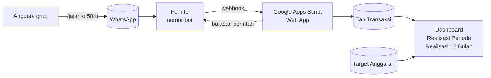
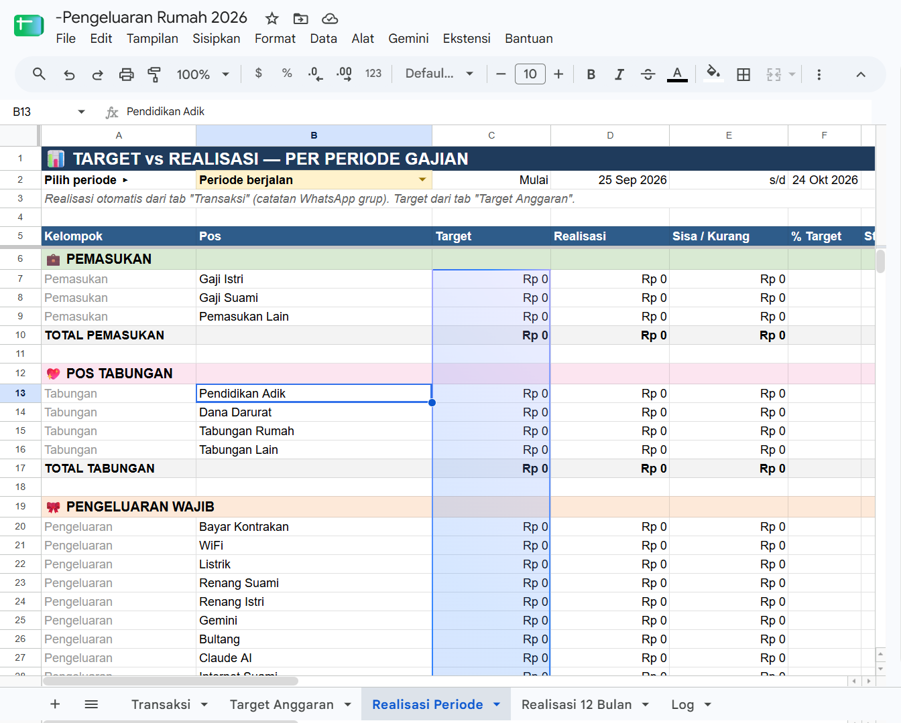

# 💰 Bot Keuangan WhatsApp → Google Sheets

Catat pemasukan, tabungan, dan pengeluaran keluarga cukup dengan mengetik di grup WhatsApp. Semua catatan masuk otomatis ke Google Sheets dan langsung dihitung sebagai dashboard **Target vs Realisasi** per periode gajian.

```
/kontrakan 1.500.000
/jajan o 50rb
/nabung 1jt kuliah a
/masuk 5.000.000 gaji istri
```


---

## ✨ Fitur

- **Catat dari grup WhatsApp.** Satu grup menjadi satu buku keuangan bersama untuk semua anggota.
- **Pengenalan pos otomatis.** Pesan seperti `/belanja sayur 85rb` langsung masuk ke pos *Belanja Mingguan*, tanpa perlu memilih kategori.
- **Format nominal bebas.** Bisa ditulis `25000`, `25.000`, `25rb`, `25k`, atau `1,5jt`.
- **Periode gajian 25 → 24.** Realisasi dihitung sesuai siklus gajian, bukan bulan kalender.
- **Dashboard otomatis.** Tersedia tampilan per periode (dengan dropdown) dan tampilan 12 periode, lengkap dengan status 🟢 🟡 🔴, scorecard arus kas, dan akumulasi tabungan.
- **Hemat kuota.** Catatan transaksi di grup tersimpan tanpa balasan. Bot hanya membalas saat ada perintah atau format pesan salah.
- **Perintah informasi.** Tersedia `/sisa`, `/rekap`, `/hari ini`, `/saldo`, `/hapus`, `/kategori`, dan `/bantuan`.
- **Aman untuk banyak pengguna.** Nomor dan grup bisa dibatasi lewat whitelist, dan `/hapus` hanya menghapus catatan milik pengirimnya sendiri.
- **Mendukung semua lokal spreadsheet.** Rumus otomatis menyesuaikan pemisah `,` atau `;`.

## 🏗️ Arsitektur



Sistem ini tidak memakai server atau basis data terpisah. Seluruhnya berjalan di Google Sheets dan Apps Script.

## 📁 Struktur Repositori

```
.
├── README.md
├── src/
│   └── BotKeuanganWA.gs     # seluruh kode bot + pembuat dashboard
└── docs/
    ├── SRS.md               # spesifikasi kebutuhan perangkat lunak
    ├── USER_GUIDE.md        # panduan anggota grup & admin
    └── TECHNICAL.md         # dokumentasi teknis untuk developer
```

## 🚀 Mulai Cepat

**Yang dibutuhkan:** akun Google, akun [Fonnte](https://fonnte.com) dengan satu device, dan satu nomor WhatsApp khusus bot (berbeda dari nomor pribadi).

1. **Siapkan spreadsheet.** Buka Google Sheets, lalu pilih **Ekstensi → Apps Script**.
2. **Tempel kode.** Salin isi [`src/BotKeuanganWA.gs`](src/BotKeuanganWA.gs). Pastikan hanya ada satu file `.gs` di proyek.
3. **Isi konfigurasi.** Lengkapi `CONFIG` di bagian atas kode, minimal:
   ```javascript
   FONNTE_TOKEN: 'token device Fonnte',
   ALLOWED_NUMBERS: ['628xxxxxxxxx1', '628xxxxxxxxx2'],
   GRUP_DASHBOARD: '120363xxxxxxxxxxxx@g.us',
   ```
4. **Atur zona waktu.** Gunakan **Asia/Jakarta** di Setelan proyek Apps Script dan di Setelan spreadsheet.
5. **Jalankan fungsi awal.** Jalankan `setup`, lalu `buatDashboard`.
6. **Deploy.** Pilih **Terapkan → Deployment baru → Aplikasi web**, atur *Jalankan sebagai: Saya* dan *Akses: Siapa saja*, lalu salin URL `/exec`.
7. **Pasang webhook.** Tempel URL tadi ke kolom **Webhook** device di Fonnte dan aktifkan **Autoread**.
8. **Masukkan bot ke grup.** Tambahkan nomor bot ke grup, jalankan `ambilDaftarGrup`, lalu kirim `/bantuan` di grup.

Langkah lengkap beserta pemecahan masalah ada di **[Panduan Pengguna](docs/USER_GUIDE.md)**.

> ⚠️ Setiap kali kode atau `CONFIG` diubah, lakukan **Terapkan → Kelola deployment → ✏️ → Versi baru**. Tanpa langkah ini, bot tetap memakai kode lama.

## 💬 Cara Pakai

**Pola pesan** (di grup wajib diawali `/`):

```
/jenis  nominal  keterangan  #pos
```

| Contoh | Tercatat sebagai |
|---|---|
| `/kontrakan 1.500.000` | Pengeluaran → Bayar Kontrakan |
| `/krl 6000` | Pengeluaran → Ongkos KRL |
| `/beras 75rb` | Pengeluaran → Belanja Bulanan |
| `/masuk 5.000.000 gaji istri` | Pemasukan → Gaji Istri |
| `/nabung 1jt rumah` | Tabungan → Tabungan Rumah |
| `/keluar 300rb kado #Lainnya` | Pengeluaran → Lainnya |

**Perintah:**

| Perintah | Fungsi |
|---|---|
| `/sisa` | Sisa anggaran setiap pos di periode berjalan |
| `/hari ini` | Catatan hari ini |
| `/rekap` · `/rekap 9 2026` | Rekap periode gajian |
| `/saldo` | Saldo sepanjang waktu |
| `/hapus` | Hapus catatan terakhir milik sendiri |
| `/kategori` | Daftar pos dan kata kunci |
| `/bantuan` | Panduan singkat |

## 📊 Dashboard

| Tab | Isi |
|---|---|
| **Transaksi** | Semua catatan mentah dari WhatsApp |
| **Target Anggaran** | Anggaran per pos (kolom kuning dapat diedit) |
| **Realisasi Periode** | Target vs realisasi untuk satu periode pilihan, dengan status dan scorecard |
| **Realisasi 12 Bulan** | Grid pos × 12 periode gajian, dengan pewarnaan otomatis dan akumulasi tabungan |

## ⚙️ Konfigurasi Penting

| Kunci | Bawaan | Fungsi |
|---|---|---|
| `BALAS_TRANSAKSI_GRUP` | `false` | Balas konfirmasi setiap transaksi di grup |
| `BALAS_FORMAT_SALAH_GRUP` | `true` | Balas petunjuk jika format pesan salah |
| `TANGGAL_GAJIAN` | `25` | Tanggal awal periode |
| `PERIODE_AWAL` | `{ tahun: 2026, bulan: 9 }` | Periode pertama di dashboard |
| `DEBUG` | `false` | Simpan payload webhook ke tab `Log` |

Daftar lengkap konfigurasi ada di [SRS · Lampiran B](docs/SRS.md#b-referensi-konfigurasi-config).

## 🔒 Keamanan

Repositori ini **tidak boleh** berisi data asli. Sebelum melakukan commit, pastikan:

- `FONNTE_TOKEN` masih berisi placeholder `'ISI_TOKEN_FONNTE_ANDA'`;
- nomor telepon dan ID grup sudah diganti dengan contoh (`628xxxxxxxxxx`, `120363xxxxxxxxxxxx@g.us`);
- tidak ada screenshot yang memperlihatkan token atau nomor asli.

Jika token sempat ter-commit, segera **buat token baru** di dashboard Fonnte.

## 📚 Dokumentasi

- **[Panduan Pengguna](docs/USER_GUIDE.md)**: cara mencatat, membaca dashboard, instalasi, dan pemecahan masalah.
- **[Software Requirements Specification](docs/SRS.md)**: kebutuhan fungsional dan non-fungsional, skema data, antarmuka API, serta riwayat versi.
- **[Dokumentasi Teknis](docs/TECHNICAL.md)**: arsitektur, alur eksekusi, algoritma, generator dashboard, deployment, pengujian, dan panduan pengembangan.
- 

## 🗺️ Rencana Pengembangan

- [ ] Pengingat otomatis setiap malam untuk mencatat pengeluaran
- [ ] Rekap mingguan yang terkirim otomatis ke grup
- [ ] Peringatan saat sebuah pos mencapai 80% anggaran
- [ ] Arsip otomatis transaksi tahunan

## 📝 Riwayat Versi

| Versi | Perubahan |
|---|---|
| 3.3 | Deteksi lokal spreadsheet dan konversi pemisah rumus otomatis |
| 3.2 | Transaksi di grup tersimpan tanpa balasan |
| 3.1 | Tab `Target Anggaran` mandiri; perbaikan freeze kolom |
| 3.0 | Pos anggaran keluarga, periode gajian 25 → 24, perintah `/sisa`, dashboard 12 periode |
| 2.0 | Dukungan grup WhatsApp |
| 1.0 | Pencatatan via chat pribadi |
