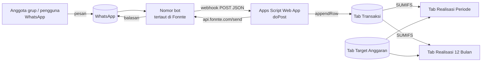
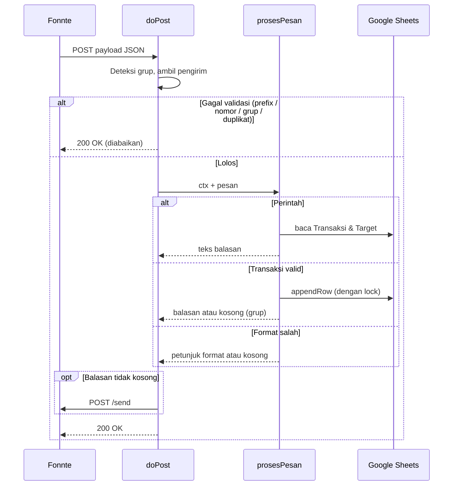

# Software Requirements Specification (SRS)
## Bot Pencatatan Keuangan WhatsApp → Google Sheets

| Atribut | Keterangan |
|---|---|
| Nama produk | Bot Keuangan WhatsApp (`BotKeuanganWA.gs`) |
| Versi dokumen | 1.0 |
| Versi perangkat lunak | 3.x (dukungan grup, dashboard 12 periode, target anggaran) |
| Tanggal | 2 Oktober 2026 |
| Platform | Google Apps Script + Google Sheets |
| Gateway WhatsApp | Fonnte (`api.fonnte.com`) |
| Status | Disetujui untuk penggunaan internal keluarga |

---

## Daftar Isi

1. [Pendahuluan](#1-pendahuluan)
2. [Deskripsi Umum](#2-deskripsi-umum)
3. [Kebutuhan Fungsional](#3-kebutuhan-fungsional)
4. [Kebutuhan Data](#4-kebutuhan-data)
5. [Kebutuhan Antarmuka Eksternal](#5-kebutuhan-antarmuka-eksternal)
6. [Kebutuhan Non-Fungsional](#6-kebutuhan-non-fungsional)
7. [Batasan dan Risiko yang Diketahui](#7-batasan-dan-risiko-yang-diketahui)
8. [Lampiran](#8-lampiran)

---

## 1. Pendahuluan

### 1.1 Tujuan

Dokumen ini mendefinisikan kebutuhan perangkat lunak untuk bot WhatsApp yang mencatat transaksi keuangan rumah tangga (pemasukan, tabungan, dan pengeluaran) ke Google Sheets, lalu menyajikannya sebagai dashboard *Target vs Realisasi* per periode gajian. Dokumen ini ditujukan bagi pemelihara kode (*maintainer*), admin spreadsheet, dan siapa pun yang ingin mengembangkan sistem ini lebih lanjut.

### 1.2 Ruang Lingkup

Sistem ini:

- menerima pesan WhatsApp dari chat pribadi dan grup melalui webhook Fonnte;
- mengurai pesan berformat bebas menjadi transaksi terstruktur (jenis, nominal, pos, keterangan);
- menyimpan transaksi ke tab `Transaksi` di Google Sheets;
- menghitung realisasi per pos anggaran berdasarkan periode gajian (tanggal 25 s/d 24);
- menyediakan perintah informasi (saldo, sisa anggaran, rekap, dan lainnya) melalui WhatsApp;
- membangun tab dashboard otomatis untuk 12 periode gajian.

Di luar ruang lingkup: integrasi rekening bank, OCR struk, multi-mata uang, dan aplikasi web/mobile terpisah.

### 1.3 Definisi dan Singkatan

| Istilah | Arti |
|---|---|
| **Buku** | Kumpulan transaksi milik satu pemilik. Chat pribadi = buku per nomor; grup = satu buku bersama (ID grup). |
| **Pos** | Kategori anggaran, misalnya *Bayar Kontrakan* atau *Kuliah A*. |
| **Periode gajian** | Rentang tanggal 25 suatu bulan sampai tanggal 24 bulan berikutnya. Diberi label sesuai bulan mulainya, misalnya *Gajian Sep 2026* = 25 Sep – 24 Okt 2026. |
| **Realisasi** | Jumlah nominal transaksi yang tercatat untuk suatu pos dalam satu periode. |
| **Target** | Anggaran per periode untuk suatu pos (tab `Target Anggaran`). |
| **Prefix** | Karakter awalan wajib untuk pesan grup, bawaan `/`. |
| **Device** | Nomor WhatsApp bot yang ditautkan ke Fonnte. |
| **Web App** | Deployment Apps Script yang menyediakan endpoint `doPost` untuk webhook. |
| **LID** | *Linked ID*, format ID internal WhatsApp yang dapat muncul pada payload Fonnte. |

### 1.4 Referensi

- Dokumentasi Fonnte API: <https://docs.fonnte.com>
- Google Apps Script Web Apps: <https://developers.google.com/apps-script/guides/web>
- Kuota layanan Apps Script: <https://developers.google.com/apps-script/guides/services/quotas>
- Panduan pengguna proyek ini: [`USER_GUIDE.md`](./USER_GUIDE.md)

---

## 2. Deskripsi Umum

### 2.1 Perspektif Produk

Sistem merupakan *container-bound script* pada satu file Google Sheets. Tidak ada server atau basis data terpisah; Google Sheets berfungsi sebagai penyimpanan sekaligus lapisan presentasi.



### 2.2 Fungsi Utama Produk

| Kode | Fungsi |
|---|---|
| F1 | Menerima dan memvalidasi pesan dari webhook Fonnte |
| F2 | Mengurai pesan menjadi transaksi (jenis, nominal, pos, keterangan) |
| F3 | Mengenali pos otomatis dari kata kunci |
| F4 | Menyimpan transaksi ke Google Sheets |
| F5 | Menjalankan perintah informasi (`saldo`, `sisa`, `hari ini`, `rekap`, `hapus`, `kategori`, `bantuan`) |
| F6 | Menghitung periode gajian 25 → 24 |
| F7 | Membangun dashboard Target vs Realisasi (periode tunggal dan 12 periode) |
| F8 | Mengirim balasan WhatsApp secara selektif untuk menghemat kuota |

### 2.3 Karakteristik Pengguna

| Peran | Deskripsi | Keahlian teknis |
|---|---|---|
| **Anggota grup** | Mencatat transaksi dan meminta informasi lewat WhatsApp. | Rendah, cukup bisa mengetik pesan. |
| **Admin** | Memasang script, mengatur konfigurasi, men-deploy, mengubah target anggaran. | Menengah, bisa membuka Apps Script dan menjalankan fungsi. |
| **Pemelihara (developer)** | Mengubah kode, menambah pos atau fitur. | Menengah–tinggi, memahami JavaScript/Apps Script. |

### 2.4 Lingkungan Operasi

- Akun Google dengan akses ke Google Sheets dan Apps Script (runtime V8).
- Akun Fonnte dengan satu device berstatus *Connect*.
- Nomor WhatsApp khusus bot (berbeda dari nomor pengguna).
- Zona waktu proyek Apps Script dan spreadsheet: `Asia/Jakarta` (GMT+7).
- Lokal spreadsheet bebas (Indonesia maupun Inggris); script mendeteksi pemisah rumus otomatis.

### 2.5 Batasan Desain

- Penyimpanan hanya di Google Sheets; tidak ada basis data eksternal.
- Satu proyek Apps Script hanya boleh berisi satu file `.gs` dengan deklarasi `CONFIG` (deklarasi ganda menyebabkan `SyntaxError`).
- Setiap perubahan kode wajib di-deploy sebagai **versi baru** agar aktif di webhook.
- Pengiriman pesan tunduk pada kuota paket Fonnte.

### 2.6 Asumsi dan Ketergantungan

- Fonnte mengirim payload JSON dengan field `sender`, `member`, `message`, `isgroup`, `name` (lihat [§5.1](#51-webhook-masuk-fonnte--apps-script)).
- Grup sudah terdaftar di daftar grup device Fonnte sebelum bot dapat mengirim ke grup tersebut.
- Pengguna menulis nominal dalam Rupiah tanpa desimal.

---

## 3. Kebutuhan Fungsional

Prioritas: **W** = Wajib, **P** = Penting, **O** = Opsional.

### 3.1 Penerimaan Pesan (Webhook)

| ID | Kebutuhan | Prioritas |
|---|---|---|
| FR-01 | Sistem harus menyediakan endpoint `doPost(e)` yang menerima payload JSON maupun form dari Fonnte. | W |
| FR-02 | Sistem harus menyediakan `doGet()` yang mengembalikan teks status untuk pengecekan endpoint. | P |
| FR-03 | Sistem harus mengenali pesan grup jika `sender` mengandung `@g.us` **atau** `isgroup` bernilai `true`. | W |
| FR-04 | Untuk pesan grup, nomor pengirim diambil dari `member`; untuk chat pribadi dari `sender`. | W |
| FR-05 | Pesan grup yang tidak diawali `PREFIX_GRUP` harus diabaikan tanpa diproses. | W |
| FR-06 | Di chat pribadi, prefix bersifat opsional dan dibuang bila ada. | P |
| FR-07 | Jika `ALLOWED_NUMBERS` tidak kosong, pesan dari nomor di luar daftar harus diabaikan. | W |
| FR-08 | Jika `ALLOWED_GROUPS` tidak kosong, pesan dari grup di luar daftar harus diabaikan. | P |
| FR-09 | Jika `IZINKAN_GRUP` = `false`, semua pesan grup harus diabaikan. | O |
| FR-10 | Sistem harus mencegah pemrosesan ganda pesan yang sama dalam 20 detik (cache berdasarkan `inboxid`/`id`, atau gabungan pengirim + pesan + `timestamp`). | W |
| FR-11 | Jika `DEBUG` = `true`, payload mentah harus dicatat ke tab `Log`, dengan pemangkasan otomatis saat melebihi 300 baris. | O |
| FR-12 | `doPost` harus selalu mengembalikan HTTP 200 berisi `{"status":"ok"}`, termasuk ketika terjadi error internal. | W |

### 3.2 Penguraian Transaksi

| ID | Kebutuhan | Prioritas |
|---|---|---|
| FR-20 | Pola pesan transaksi: `[jenis] [nominal] [keterangan] [#pos]`; urutan nominal dan keterangan bebas. | W |
| FR-21 | Kata jenis di awal pesan: `masuk/pemasukan/terima/dapat` → Pemasukan; `keluar/pengeluaran` → Pengeluaran; `nabung/menabung/tabung/setor/simpan` → Tabungan. Tanda `+`/`-` di awal juga diterima. | W |
| FR-22 | Format nominal yang didukung: `25000`, `25.000`, `25,000`, `25rb`, `25ribu`, `25k`, `1,5jt`, `1.5jt`, `2juta`, dengan awalan `Rp` opsional. | W |
| FR-23 | Bila ada lebih dari satu angka, nominal terbesar dipilih (contoh: `beli 2 kopi 30rb` → 30.000). | P |
| FR-24 | Pesan tanpa nominal valid harus ditolak sebagai *format salah*. | W |
| FR-25 | Pos ditentukan dengan mencocokkan kata kunci pada keterangan; jika beberapa cocok, kata kunci **terpanjang** yang dipilih (contoh: `jajan o` mengalahkan `jajan`). | W |
| FR-26 | Tagar `#NamaPos` mengesampingkan deteksi otomatis. Tagar yang tidak cocok dengan pos mana pun disimpan apa adanya sebagai kategori. | P |
| FR-27 | Jika jenis tidak disebut, jenis mengikuti kelompok pos yang terdeteksi; jika pos tidak terdeteksi, jenis = Pengeluaran dan kategori = `Lainnya`. | W |
| FR-28 | Jika jenis disebut tetapi pos yang terdeteksi berbeda kelompok, kategori jatuh ke `Pemasukan Lain`, `Tabungan Lain`, atau `Lainnya` sesuai jenis. | P |

### 3.3 Penyimpanan

| ID | Kebutuhan | Prioritas |
|---|---|---|
| FR-30 | Setiap transaksi valid harus ditambahkan sebagai satu baris di tab `Transaksi` (skema di [§4.1](#41-tab-transaksi)). | W |
| FR-31 | Penulisan dan penghapusan harus memakai `LockService` agar aman saat beberapa pesan masuk bersamaan. | W |
| FR-32 | ID buku dan nomor pengirim harus disimpan sebagai teks agar angka panjang tidak berubah format. | W |
| FR-33 | Setiap baris memiliki ID unik 8 karakter. | O |

### 3.4 Perintah

| ID | Perintah | Alias | Perilaku | Prioritas |
|---|---|---|---|---|
| FR-40 | `bantuan` | `help`, `menu`, `start`, `halo`, `hai` | Mengirim panduan format dan daftar perintah. | W |
| FR-41 | `saldo` | – | Total masuk, nabung, keluar, dan sisa kas sepanjang waktu untuk buku tersebut. | P |
| FR-42 | `sisa` | `anggaran`, `budget` | Sisa anggaran setiap pos untuk periode berjalan, beserta progres tabungan dan total *di luar pos*. | W |
| FR-43 | `hari ini` | – | Daftar transaksi hari ini beserta jam, pos, dan (di grup) nama pengirim. | P |
| FR-44 | `rekap [bulan] [tahun]` | `laporan` | Rekap satu periode gajian per jenis dan pos; di grup ditambah pengeluaran per anggota. Tanpa argumen = periode berjalan. | W |
| FR-45 | `hapus` | `undo`, `batal` | Menghapus transaksi terakhir di buku tersebut. **Di grup hanya transaksi milik pengirim sendiri.** | W |
| FR-46 | `kategori` | `pos` | Daftar pos per kelompok beserta contoh kata kunci. | P |

### 3.5 Balasan WhatsApp

| ID | Kebutuhan | Prioritas |
|---|---|---|
| FR-50 | Di chat pribadi, setiap transaksi tersimpan harus dibalas dengan konfirmasi, status anggaran pos, dan ringkasan periode. | P |
| FR-51 | Di grup, jika `BALAS_TRANSAKSI_GRUP` = `false` (bawaan), transaksi tersimpan **tanpa** balasan. | W |
| FR-52 | Di grup, jika `BALAS_FORMAT_SALAH_GRUP` = `true` (bawaan), pesan berformat salah dibalas dengan petunjuk pola. | P |
| FR-53 | Perintah ([§3.4](#34-perintah)) selalu dibalas, baik di grup maupun pribadi. | W |
| FR-54 | Balasan dikirim ke ID grup untuk pesan grup dan ke nomor pengirim untuk chat pribadi. | W |
| FR-55 | Respons API Fonnte harus dicatat ke log eksekusi (`console.log`) untuk diagnosis. | P |

### 3.6 Periode Gajian

| ID | Kebutuhan | Prioritas |
|---|---|---|
| FR-60 | Periode dimulai pada `TANGGAL_GAJIAN` (bawaan 25) dan berakhir sehari sebelum tanggal yang sama bulan berikutnya. | W |
| FR-61 | Transaksi sebelum tanggal 25 masuk ke periode bulan sebelumnya. | W |
| FR-62 | Perbandingan tanggal di sisi script dilakukan dengan string `yyyy-MM-dd` pada `CONFIG.TIMEZONE` agar tidak terpengaruh zona waktu proyek. | W |
| FR-63 | Pergantian tahun harus ditangani (Gajian Des 2026 = 25 Des 2026 – 24 Jan 2027). | W |

### 3.7 Dashboard

| ID | Kebutuhan | Prioritas |
|---|---|---|
| FR-70 | Fungsi `buatDashboard()` membuat atau membangun ulang tab `_Periode`, `Realisasi Periode`, dan `Realisasi 12 Bulan`; aman dijalankan berulang kali. | W |
| FR-71 | `buatDashboard()` membuat tab `Target Anggaran` bila belum ada. Nilai awal diambil dari tab `Dashboard Nabung` bila ada, jika tidak dari nilai `target` di daftar `POS`. | W |
| FR-72 | Angka target yang sudah diubah pengguna di `Target Anggaran` **tidak boleh ditimpa** saat `buatDashboard()` dijalankan ulang; hanya pos baru yang ditambahkan. | W |
| FR-73 | Tab `_Periode` berisi label serta tanggal mulai dan selesai untuk `JUMLAH_PERIODE` periode sejak `PERIODE_AWAL`, ditambah baris *Periode berjalan* berbasis `TODAY()`. Tab ini disembunyikan. | W |
| FR-74 | `Realisasi Periode` menyediakan dropdown periode di sel B2 serta kolom Target, Realisasi, Sisa/Kurang, % Target, dan Status untuk setiap pos. | W |
| FR-75 | Status pengeluaran: 🟢 Aman (< 80%), 🟡 Hampir habis (≥ 80%), 🔴 Lewat anggaran (> 100%), ⚠️ Tidak dianggarkan (target 0 tetapi ada realisasi). Status pemasukan/tabungan: ✅ Tercapai, ⏳ Sebagian, ⬜ Belum. | P |
| FR-76 | Kedua dashboard memiliki baris **Di luar pos** = total pengeluaran periode dikurangi jumlah pos pengeluaran yang terdaftar. | W |
| FR-77 | Kedua dashboard memiliki scorecard: total pemasukan, tabungan, pengeluaran, dan sisa kas. `Realisasi 12 Bulan` menambahkan akumulasi tabungan dan rasio tabungan/pemasukan. | P |
| FR-78 | `Realisasi 12 Bulan` menerapkan format bersyarat: merah untuk pengeluaran > target, hijau untuk tabungan ≥ target, kuning untuk kolom periode berjalan. | P |
| FR-79 | Dashboard hanya menghitung transaksi dengan ID buku = `GRUP_DASHBOARD`. | W |
| FR-80 | Rumus harus dikonversi sesuai lokal spreadsheet (pemisah `,` atau `;`, desimal `.` atau `,`) melalui deteksi otomatis. | W |

### 3.8 Fungsi Utilitas Admin

| ID | Fungsi | Kegunaan |
|---|---|---|
| FR-90 | `setup()` | Menyimpan ID spreadsheet ke Script Properties, membuat tab `Transaksi` beserta header dan format. |
| FR-91 | `ambilDaftarGrup()` | Memanggil Fonnte `fetch-group` lalu `get-whatsapp-group` untuk mendaftarkan grup baru. |
| FR-92 | `testPengenalan()` | Menguji penguraian sejumlah contoh pesan tanpa menulis ke sheet. |

### 3.9 Alur Pemrosesan Pesan



---

## 4. Kebutuhan Data

### 4.1 Tab `Transaksi`

| Kolom | Nama | Tipe | Contoh | Keterangan |
|---|---|---|---|---|
| A | Waktu | DateTime | `02/10/2026 02:21` | Waktu pesan diproses |
| B | ID Buku (No/Grup) | Teks | `1203630…@g.us` | ID grup atau nomor pribadi |
| C | Nama | Teks | `Fulan` | Nama WhatsApp pengirim |
| D | Jenis | Teks | `Pengeluaran` | `Pemasukan` / `Tabungan` / `Pengeluaran` |
| E | Kategori | Teks | `Bayar Kontrakan` | Nama pos, `Lainnya`, atau tagar bebas |
| F | Nominal | Angka | `1500000` | Rupiah, bilangan bulat |
| G | Keterangan | Teks | `kontrakan` | Sisa teks setelah jenis dan nominal dibuang |
| H | Pesan Asli | Teks | `kontrakan 1.500.000` | Setelah prefix dibuang |
| I | ID | Teks | `3ada01d0` | ID unik baris |
| J | No Pengirim | Teks | `628xxxxxxxxxx` | Dipakai untuk aturan `hapus` di grup |

### 4.2 Tab `Target Anggaran`

| Kolom | Isi |
|---|---|
| A | Kelompok (`Pemasukan` / `Tabungan` / `Pengeluaran`) |
| B | Nama pos (harus sama persis dengan `POS[].nama`) |
| C | Target per periode (dapat diedit, berlatar kuning) |
| D | Catatan bebas |

### 4.3 Tab `_Periode` (tersembunyi)

| Sel | Isi |
|---|---|
| A2:C2 | `Periode berjalan` beserta tanggal mulai dan selesai berbasis `TODAY()` |
| A3:C14 | Label `Gajian <Bln> <Tahun>`, tanggal mulai, tanggal selesai (eksklusif) |
| E2 | ID grup dashboard (`GRUP_DASHBOARD`) |

### 4.4 Struktur Daftar `POS`

```javascript
{ k: 'Pengeluaran',          // kelompok
  nama: 'Bayar Kontrakan',   // nama kategori yang tersimpan
  target: 0,                 // nilai awal; angka asli diisi di tab Target Anggaran
  cari: 'Bayar Kontrakan',   // nama baris di tab Dashboard Nabung (opsional)
  kata: ['kontrakan', 'sewa rumah', 'sewa'] }  // kata kunci
```

Daftar lengkap pos ada di [Lampiran A](#a-daftar-pos-dan-kata-kunci).

---

## 5. Kebutuhan Antarmuka Eksternal

### 5.1 Webhook Masuk (Fonnte → Apps Script)

**Metode:** `POST` ke URL Web App (`.../exec`)

Contoh payload pesan grup (data disamarkan):

```json
{
  "device": "08xxxxxxxxxx",
  "sender": "120363xxxxxxxxxxxx@g.us",
  "member": "628xxxxxxxxxx",
  "isgroup": true,
  "name": "Nama Anggota",
  "message": "/bantuan",
  "pesan": "/bantuan",
  "inboxid": 0,
  "timestamp": 1790838096,
  "type": "text",
  "mode": "lid"
}
```

| Field | Dipakai untuk |
|---|---|
| `sender` | ID grup (`@g.us`) atau nomor pengirim pribadi |
| `member` | Nomor anggota pengirim pesan grup |
| `isgroup` | Penanda pesan grup |
| `message` / `pesan` | Isi pesan |
| `name` / `pushname` | Nama tampilan pengirim |
| `inboxid`, `id`, `timestamp` | Kunci pencegah duplikasi |

### 5.2 Pengiriman Pesan (Apps Script → Fonnte)

| Atribut | Nilai |
|---|---|
| Endpoint | `POST https://api.fonnte.com/send` |
| Header | `Authorization: <token device>` |
| Body (form) | `target`, `message`, `countryCode=62` |
| Contoh respons gagal | `{"status":false,"reason":"invalid group id"}` |

### 5.3 Endpoint Grup Fonnte

| Endpoint | Fungsi |
|---|---|
| `POST https://api.fonnte.com/fetch-group` | Memperbarui daftar grup device |
| `POST https://api.fonnte.com/get-whatsapp-group` | Mengambil daftar grup beserta ID-nya |

### 5.4 Antarmuka Pengguna

Antarmuka pengguna berupa pesan teks WhatsApp dengan format tebal (`*...*`), miring (`_..._`), dan monospace (`` ```...``` ``). Dashboard disajikan di Google Sheets.

---

## 6. Kebutuhan Non-Fungsional

| ID | Kategori | Kebutuhan |
|---|---|---|
| NFR-01 | Kinerja | Pemrosesan satu pesan transaksi selesai < 10 detik pada ≤ 5.000 baris transaksi. |
| NFR-02 | Kinerja | `buatDashboard()` selesai < 2 menit (di bawah batas 6 menit per eksekusi Apps Script). |
| NFR-03 | Keandalan | Error di `doPost` tidak boleh menghentikan respons HTTP 200 ke Fonnte, agar Fonnte tidak mengirim ulang tanpa henti. |
| NFR-04 | Keandalan | Penulisan bersamaan tidak boleh menghilangkan atau menggandakan baris (dijamin oleh lock + cache dedup). |
| NFR-05 | Keamanan | Token Fonnte **tidak boleh** di-commit ke repositori publik. File di repositori wajib memakai placeholder `ISI_TOKEN_FONNTE_ANDA`. |
| NFR-06 | Keamanan | Nomor telepon dan ID grup asli tidak boleh muncul di repositori publik. |
| NFR-07 | Keamanan | Produksi disarankan memakai `ALLOWED_NUMBERS` dan `ALLOWED_GROUPS` yang terisi. |
| NFR-08 | Privasi | Spreadsheet dibagikan ke anggota hanya dengan akses *Pelihat*. |
| NFR-09 | Efisiensi kuota | Bawaan konfigurasi meminimalkan pesan keluar: tidak ada balasan untuk transaksi di grup. |
| NFR-10 | Portabilitas | Rumus dashboard harus berfungsi di lokal spreadsheet berpemisah koma maupun titik koma. |
| NFR-11 | Pemeliharaan | Penambahan pos cukup dilakukan dengan menambah objek di `POS` lalu menjalankan `buatDashboard()`. |
| NFR-12 | Kegunaan | Pesan bantuan memuat pola penulisan, contoh, dan daftar perintah dalam satu balasan. |

---

## 7. Batasan dan Risiko yang Diketahui

| No | Batasan / Risiko | Dampak | Mitigasi |
|---|---|---|---|
| 1 | Mengirim pesan dari nomor bot ke dirinya sendiri tidak memicu webhook. | Bot terlihat tidak merespons. | Gunakan nomor pengguna yang berbeda dari nomor bot. |
| 2 | Tautan perangkat WhatsApp terputus bila HP utama bot lama tidak aktif (± 14 hari). | Bot berhenti total. | Buka WhatsApp di HP bot minimal seminggu sekali. |
| 3 | Grup baru belum dikenal Fonnte (`invalid group id`). | Balasan ke grup gagal; pencatatan tetap jalan. | Jalankan `ambilDaftarGrup()`. |
| 4 | Paket gratis Fonnte memiliki kuota dan watermark *Sent via fonnte.com*. | Balasan bisa terhenti saat kuota habis. | Biarkan `BALAS_TRANSAKSI_GRUP: false`; pertimbangkan upgrade paket. |
| 5 | Kata kunci ambigu (`renang`, `gaji`) tidak dapat dipetakan ke pemilik tertentu. | Masuk *Di luar pos* atau *Pemasukan Lain*. | Tulis lengkap: `renang suami`, `gaji istri`. |
| 6 | Setiap perintah membaca seluruh tab `Transaksi`. | Respons melambat jika data sangat besar (> 10.000 baris). | Arsipkan data tahun sebelumnya ke file lain. |
| 7 | Perubahan kode tidak aktif tanpa deploy versi baru. | Bot menjalankan perilaku lama. | Selalu lakukan *Kelola deployment → Versi baru*. |
| 8 | Dashboard terbatas pada `JUMLAH_PERIODE` sejak `PERIODE_AWAL`. | Periode setelah Gajian Agu 2027 tidak tampil. | Ubah `PERIODE_AWAL`, jalankan `buatDashboard()`. |
| 9 | Transaksi dari chat pribadi tidak masuk dashboard. | Realisasi tampak lebih kecil. | Catat transaksi rumah tangga di grup. |

---

## 8. Lampiran

### A. Daftar Pos dan Kata Kunci

| Kelompok | Pos | Contoh kata kunci |
|---|---|---|
| Pemasukan | Gaji Istri | gaji istri |
| Pemasukan | Gaji Suami | gaji suami |
| Pemasukan | Pemasukan Lain | gaji, bonus, thr, komisi, jualan, refund |
| Tabungan | Kuliah A | kuliah a, kuliah, ukt, semester |
| Tabungan | Dana Darurat | dana darurat, darurat, brankas |
| Tabungan | Tabungan Rumah | tabungan rumah, rumah, emas, antam, lm |
| Tabungan | Tabungan Lain | (otomatis untuk `nabung` tanpa pos) |
| Pengeluaran | Bayar Kontrakan | kontrakan, sewa rumah, sewa |
| Pengeluaran | WiFi | wifi, indihome, biznet |
| Pengeluaran | Listrik | listrik, pln, token |
| Pengeluaran | Renang Suami | renang suami |
| Pengeluaran | Renang Istri | renang istri |
| Pengeluaran | Gemini | gemini, google play, google one |
| Pengeluaran | Bultang | bultang, badminton, bulutangkis |
| Pengeluaran | Claude AI | claude |
| Pengeluaran | Internet Suami | internet suami, paket data, internet |
| Pengeluaran | Pulsa Istri | pulsa istri, masa aktif, pulsa |
| Pengeluaran | BPJS Suami | bpjs |
| Pengeluaran | Kas Kantor Istri | kas kantor, iuran kas, iuran, kas |
| Pengeluaran | Jajan O | jajan o |
| Pengeluaran | Bensin Suami | bensin, pertalite, pertamax, bbm |
| Pengeluaran | Pod Suami | pod, liquid, vape, coil |
| Pengeluaran | Jajan Istri | jajan istri |
| Pengeluaran | Ongkos KRL | krl, kereta, commuter |
| Pengeluaran | Ongkos TJ/Gojek | tj, transjakarta, gojek, grab, ojol |
| Pengeluaran | Belanja Mingguan | belanja, sayur, pasar, lauk, ayam |
| Pengeluaran | Belanja Bulanan | belanja bulanan, beras, minyak, sabun, galon |
| Pengeluaran | Jajan Self-Care | jajan, kopi, snack, makan, boba |
| Pengeluaran | Pengembangan Diri | skincare, kursus, buku, baju, salon |

> Angka target sengaja tidak dicantumkan di repositori. Isi sesuai anggaran Anda di tab `Target Anggaran` (kolom C).

### B. Referensi Konfigurasi (`CONFIG`)

| Kunci | Bawaan | Fungsi |
|---|---|---|
| `FONNTE_TOKEN` | `'ISI_TOKEN_FONNTE_ANDA'` | Token **device** Fonnte |
| `ALLOWED_NUMBERS` | `[]` | Nomor yang boleh mencatat (format `62…`); kosong = semua |
| `IZINKAN_GRUP` | `true` | Aktif/nonaktifkan dukungan grup |
| `ALLOWED_GROUPS` | `[]` | ID grup yang dilayani; kosong = semua |
| `PREFIX_GRUP` | `'/'` | Awalan wajib di grup |
| `BALAS_TRANSAKSI_GRUP` | `false` | Balas konfirmasi transaksi di grup |
| `BALAS_FORMAT_SALAH_GRUP` | `true` | Balas petunjuk bila format salah di grup |
| `DEBUG` | `false` | Simpan payload mentah ke tab `Log` |
| `GRUP_DASHBOARD` | ID grup | Buku yang dihitung di dashboard |
| `TANGGAL_GAJIAN` | `25` | Tanggal awal periode |
| `PERIODE_AWAL` | `{ tahun: 2026, bulan: 9 }` | Periode pertama dashboard |
| `JUMLAH_PERIODE` | `12` | Jumlah periode di dashboard |
| `SHEET_TARGET` | `'Target Anggaran'` | Nama tab target |
| `SHEET_SUMBER` | `'Dashboard Nabung'` | Sumber target awal (opsional) |
| `TIMEZONE` | `'Asia/Jakarta'` | Zona waktu perhitungan tanggal |

### C. Riwayat Perubahan Perangkat Lunak

| Versi | Perubahan utama |
|---|---|
| 1.0 | Pencatatan via chat pribadi; kategori umum; perintah `saldo`, `hari ini`, `rekap`, `hapus`. |
| 2.0 | Dukungan grup (buku bersama), prefix `/`, `ALLOWED_GROUPS`, mode `DEBUG` + tab `Log`, `hapus` per anggota, rekap per anggota. |
| 3.0 | Pos anggaran sesuai rencana keluarga, jenis *Tabungan*, periode gajian 25 → 24, perintah `sisa`, dashboard `Realisasi Periode` dan `Realisasi 12 Bulan`. |
| 3.1 | Tab `Target Anggaran` mandiri (tidak bergantung pada `Dashboard Nabung`); perbaikan freeze kolom pada sel gabungan. |
| 3.2 | Transaksi di grup tanpa balasan (`BALAS_TRANSAKSI_GRUP`, `BALAS_FORMAT_SALAH_GRUP`). |
| 3.3 | Deteksi lokal spreadsheet dan konversi pemisah rumus otomatis (`deteksiPemisah_`, `lokal_`). |

### D. Riwayat Dokumen

| Versi | Tanggal | Perubahan |
|---|---|---|
| 1.0 | 2 Okt 2026 | Rilis awal SRS untuk perangkat lunak v3.3 |
