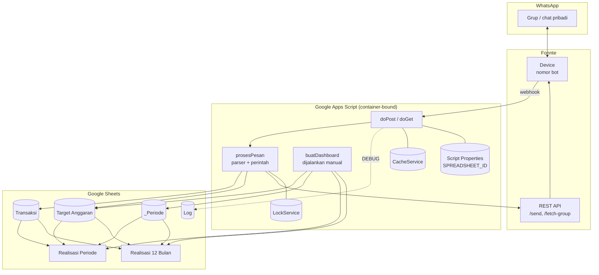
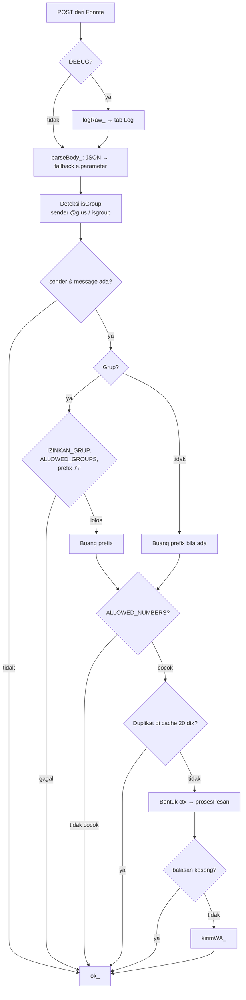
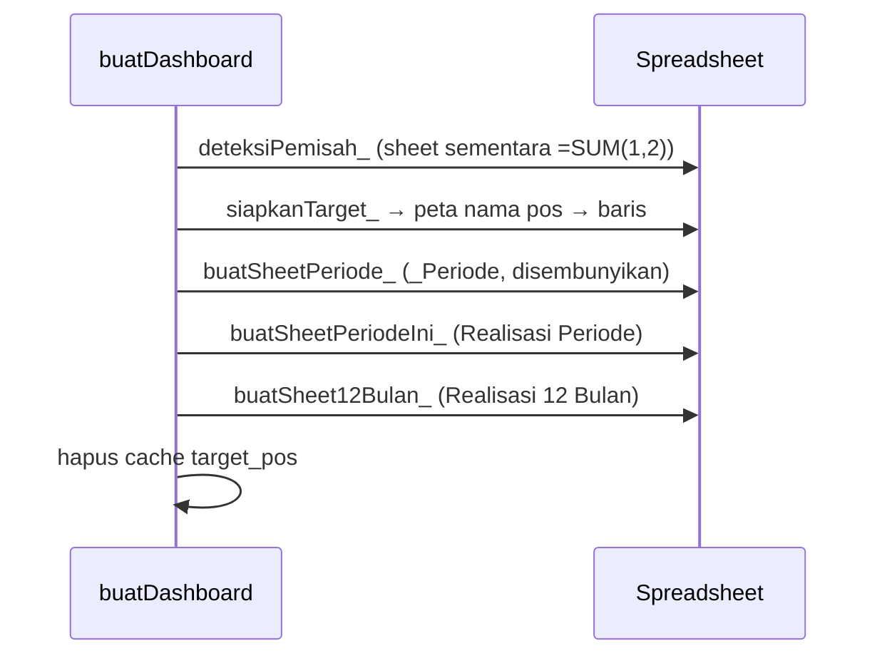
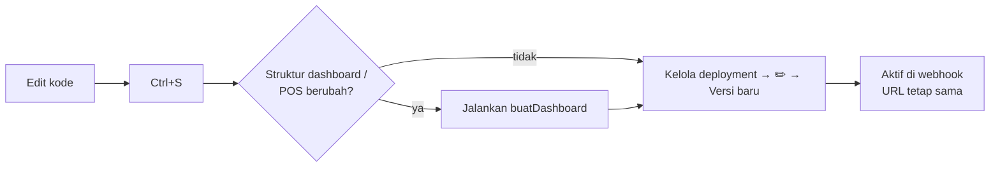

# Dokumentasi Teknis — Bot Keuangan WhatsApp

Dokumen ini menjelaskan **cara kerja kode** `src/BotKeuanganWA.gs` (v3.3): arsitektur, alur eksekusi, algoritma, pembuatan dashboard, integrasi Fonnte, deployment, pengujian, dan cara mengembangkannya.

| Dokumen terkait | Isi |
|---|---|
| [`SRS.md`](./SRS.md) | *Apa* yang harus dilakukan sistem (kebutuhan) |
| [`USER_GUIDE.md`](./USER_GUIDE.md) | *Bagaimana* memakai dan memasang sistem |
| **`TECHNICAL.md`** | *Bagaimana* sistem dibangun dan dikembangkan |

---

## Daftar Isi

1. [Tumpukan Teknologi](#1-tumpukan-teknologi)
2. [Arsitektur](#2-arsitektur)
3. [Struktur Kode](#3-struktur-kode)
4. [Alur Eksekusi Webhook](#4-alur-eksekusi-webhook)
5. [Algoritma Inti](#5-algoritma-inti)
6. [Penyimpanan, Cache, dan Lock](#6-penyimpanan-cache-dan-lock)
7. [Generator Dashboard](#7-generator-dashboard)
8. [Integrasi Fonnte](#8-integrasi-fonnte)
9. [Deployment dan Versi](#9-deployment-dan-versi)
10. [Pengujian](#10-pengujian)
11. [Logging dan Diagnosis](#11-logging-dan-diagnosis)
12. [Kinerja dan Kuota](#12-kinerja-dan-kuota)
13. [Panduan Pengembangan](#13-panduan-pengembangan)
14. [Konvensi Kode](#14-konvensi-kode)
15. [Utang Teknis](#15-utang-teknis)

---

## 1. Tumpukan Teknologi

| Lapisan | Teknologi |
|---|---|
| Runtime | Google Apps Script, runtime **V8** (ES2015+: `const`, arrow function, template literal) |
| Penyimpanan | Google Sheets (container-bound) |
| Endpoint | Apps Script **Web App** (`doGet`, `doPost`) |
| Gateway WhatsApp | Fonnte REST API |
| Layanan Apps Script | `SpreadsheetApp`, `UrlFetchApp`, `CacheService`, `LockService`, `PropertiesService`, `Utilities`, `ContentService` |

Tidak ada dependensi eksternal, library, atau build step. Seluruh kode berada dalam **satu file** sekitar 950 baris.

---

## 2. Arsitektur

### 2.1 Komponen



### 2.2 Dua Konteks Eksekusi

| Konteks | Pemicu | Fungsi yang berjalan | Catatan |
|---|---|---|---|
| **Web App** | HTTP dari Fonnte | `doPost`, `doGet` | Berjalan sebagai pemilik deployment. Memakai **versi kode yang di-deploy**, bukan versi di editor. |
| **Editor** | Tombol *Jalankan* | `setup`, `buatDashboard`, `ambilDaftarGrup`, `testPengenalan` | Selalu memakai kode terbaru di editor. |

Perbedaan inilah yang menyebabkan perubahan kode baru aktif di WhatsApp setelah **deploy versi baru** ([§9.2](#92-siklus-versi)).

### 2.3 Pembagian Tanggung Jawab

- **Script** hanya *menulis* data mentah (append ke `Transaksi`) dan *membaca* data untuk membalas perintah.
- **Rumus spreadsheet** (`SUMIFS`) melakukan agregasi untuk dashboard. Karena itu, dashboard selalu *real-time* tanpa perlu trigger atau eksekusi script tambahan.
- **`buatDashboard`** hanya *membangun struktur* (layout dan rumus). Fungsi ini cukup dijalankan ulang saat struktur berubah.

---

## 3. Struktur Kode

File diorganisasi per bagian yang dipisahkan komentar `// ===== NAMA BAGIAN =====`.

| Bagian | Isi | Simbol utama |
|---|---|---|
| **KONFIGURASI** | Konstanta global | `CONFIG`, `POS`, `KATA_MASUK`, `KATA_KELUAR`, `KATA_TABUNG`, `BLN` |
| **SETUP** | Inisialisasi tab `Transaksi` | `setup()` |
| **WEBHOOK** | Endpoint HTTP dan validasi | `doGet()`, `doPost(e)`, `parseBody_`, `ok_`, `logRaw_` |
| **LOGIKA BOT** | Router pesan dan parser | `prosesPesan`, `parseTransaksi_`, `parseNominal_`, `cariPos_`, `simpanTransaksi_` |
| **PERINTAH** | Handler perintah | `cmdSaldo_`, `cmdSisa_`, `cmdHariIni_`, `cmdRekap_`, `cmdHapus_`, `cmdKategori_`, `pesanBantuan_` |
| **PERIODE GAJIAN** | Logika tanggal | `periode_`, `periodeBerjalan_`, `dalamPeriode_`, `kunciTgl_`, `pad_` |
| **HELPER DATA** | Akses sheet dan agregasi | `getSpreadsheet_`, `getSheet_`, `ambilData_`, `hitung_`, `bacaTarget_`, `rupiah_` |
| **DASHBOARD** | Generator tab | `buatDashboard`, `siapkanTarget_`, `buatSheetPeriode_`, `buatSheetPeriodeIni_`, `buatSheet12Bulan_`, `rumusSum_`, `rumusTarget_`, `rumusStatus_`, `deteksiPemisah_`, `lokal_`, `tulis_`, `resetSheet_`, `kolom_`, `WARNA`, `JUDUL_SEKSI` |
| **KIRIM WHATSAPP** | Klien Fonnte | `kirimWA_`, `ambilDaftarGrup` |
| **TESTING** | Uji tanpa efek samping | `testPengenalan` |

---

## 4. Alur Eksekusi Webhook

### 4.1 Pipeline `doPost`



Seluruh isi `doPost` dibungkus `try/catch`. Error dicatat dengan `console.error`, dan fungsi **tetap** mengembalikan `ok_()` (HTTP 200) agar Fonnte tidak mencoba mengirim ulang.

### 4.2 Objek `ctx`

Setiap pesan yang lolos validasi diwakili oleh objek konteks:

```javascript
const ctx = {
  buku:     isGroup ? rawSender : pengirim, // kunci buku di kolom B Transaksi
  target:   isGroup ? rawSender : pengirim, // tujuan balasan
  pengirim: '628xxxxxxxxxx',                // nomor tanpa non-digit
  nama:     'Nama WhatsApp',
  isGroup:  true,
};
```

Semua handler menerima `ctx`, sehingga logika "grup vs pribadi" tidak tersebar ke mana-mana.

### 4.3 Router `prosesPesan`

1. Normalisasi: huruf kecil, spasi ganda dirapatkan, lalu di-trim.
2. Cocokkan dengan perintah secara berurutan: `bantuan` → `saldo` → `sisa` → `hari ini` → `hapus` → `kategori` → `rekap` (regex `^(rekap|laporan)\b`).
3. Jika bukan perintah, pesan diproses oleh `parseTransaksi_`:
   - `null` → balasan format salah (atau `''` jika di grup dan `BALAS_FORMAT_SALAH_GRUP = false`).
   - objek transaksi → `simpanTransaksi_`.
4. Mengembalikan string balasan. String kosong berarti tidak ada pesan yang dikirim.

---

## 5. Algoritma Inti

### 5.1 `parseTransaksi_(message)`

Langkah-langkah, secara berurutan:

1. **Tanda `+`/`-`** di karakter pertama → menetapkan jenis Pemasukan/Pengeluaran, lalu tanda dibuang.
2. **Tagar** `#([\w-]+)` → disimpan sebagai `tag` (`_` dan `-` diganti spasi), lalu dibuang dari teks.
3. **Tokenisasi** dengan pemisah spasi.
4. **Kata jenis** pada token pertama (`KATA_MASUK` / `KATA_KELUAR` / `KATA_TABUNG`) → menetapkan jenis, lalu token dibuang.
5. **Nominal**: setiap token diuji dengan `parseNominal_`, dan **nilai terbesar** yang dipakai. Token tersebut dibuang.
6. **Keterangan** = token tersisa (atau `-` jika kosong).
7. **Pos** = `cariPos_(tag || keterangan)`.
8. **Resolusi jenis dan kategori** sesuai tabel keputusan berikut:

| Tagar tak dikenal | Jenis eksplisit | Pos terdeteksi | Hasil jenis | Hasil kategori |
|:-:|---|---|---|---|
| ✔ | apa saja / – | – | eksplisit atau Pengeluaran | teks tagar (Title Case) |
| | Tabungan | kelompok Tabungan | Tabungan | `pos.nama` |
| | Tabungan | lain / tidak ada | Tabungan | `Tabungan Lain` |
| | Pemasukan | kelompok Pemasukan | Pemasukan | `pos.nama` |
| | Pemasukan | lain / tidak ada | Pemasukan | `Pemasukan Lain` |
| | Pengeluaran | kelompok Pengeluaran | Pengeluaran | `pos.nama` |
| | Pengeluaran | lain / tidak ada | Pengeluaran | `Lainnya` |
| | – | ada | `pos.k` | `pos.nama` |
| | – | tidak ada | Pengeluaran | `Lainnya` |

### 5.2 `parseNominal_(token)`

```
regex: ^(\d[\d.,]*)(rb|ribu|k|jt|juta)?$     (setelah awalan "rp"/"rp." dibuang)
```

| Kondisi | Aturan | Contoh |
|---|---|---|
| Tanpa satuan | Semua `.` dan `,` dibuang (pemisah ribuan) | `1.500.000` → 1500000 |
| Dengan satuan, tepat 1 pemisah | Pemisah dianggap desimal | `1,5jt` → 1500000 |
| Dengan satuan, > 1 pemisah | Semua pemisah dibuang | `1.500.000rb` → 1500000000 |
| `rb`/`ribu`/`k` | × 1.000 | `25k` → 25000 |
| `jt`/`juta` | × 1.000.000 | `2jt` → 2000000 |

Token seperti `5kg`, `2x`, atau `jam7` tidak cocok dengan regex, sehingga tidak dianggap nominal.

### 5.3 `cariPos_(teks)` — Longest Match

```javascript
// Untuk setiap pos, setiap kata kunci (+ nama pos itu sendiri):
//   pola = (^|[^a-z0-9]) + kata_kunci_ter-escape + ([^a-z0-9]|$)
//   jika cocok dan panjang kata kunci > panjang terbaik → jadikan kandidat
```

- **Batas kata** memakai kelas `[^a-z0-9]`, sehingga `grab` **tidak** cocok dengan `grabfood`, dan `tj` tidak cocok di dalam kata lain.
- **Kata kunci terpanjang menang**, sehingga urutan di array `POS` tidak berpengaruh. Contoh: `jajan o` (10) > `jajan` (5); `sewa rumah` (10) > `rumah` (5).
- Spasi di dalam kata kunci diubah menjadi `\s+`, sehingga toleran terhadap spasi ganda.
- Kompleksitas O(P × K) per pesan, dengan P ≈ 29 pos dan K ≈ 3–12 kata kunci. Ini dapat diabaikan.

### 5.4 Periode Gajian

Periode direpresentasikan sebagai **string tanggal** agar kebal terhadap perbedaan zona waktu antara proyek, spreadsheet, dan server:

```javascript
periode_(2026, 12) →
{
  tahun: 2026, bulan: 12,
  mulai:   '2026-12-25',          // inklusif
  selesai: '2027-01-25',          // eksklusif
  label:   'Gajian Des 2026',
  rentang: '25 Des – 24 Jan 2027'
}
```

- `periodeBerjalan_(d)`: jika tanggal (di `CONFIG.TIMEZONE`) < 25, mundur satu bulan.
- `dalamPeriode_(waktu, p)`: `kunciTgl_(waktu) >= p.mulai && kunciTgl_(waktu) < p.selesai`. Perbandingan string leksikografis valid karena format `yyyy-MM-dd`.

### 5.5 Agregasi `hitung_(rows)`

Menghasilkan satu objek akumulasi:

```javascript
{
  masuk, tabung, keluar, jumlah,
  perKat:   { 'Bayar Kontrakan': 1500000, ... },
  perJenis: { Pemasukan: {...}, Tabungan: {...}, Pengeluaran: {...} },
  perOrang: { 'Nama': totalPengeluaran, ... }   // hanya pengeluaran
}
```

**Sisa kas = masuk − tabung − keluar.** Tabungan diperlakukan sebagai arus kas keluar dari dompet harian, tetapi dilaporkan terpisah dari pengeluaran.

---

## 6. Penyimpanan, Cache, dan Lock

### 6.1 Penulisan

`simpanTransaksi_` memakai `appendRow` dengan 10 kolom (skema di [SRS §4.1](./SRS.md#41-tab-transaksi)). Kolom B dan J diberi awalan `'` supaya ID grup dan nomor tetap tersimpan sebagai teks.

### 6.2 Pembacaan

`ambilData_(buku)` membaca **seluruh** `getDataRange()`, lalu memfilter baris yang kolom A-nya bertipe `Date` dan kolom B-nya sama dengan `buku`. Pendekatan ini sederhana dan cukup untuk ribuan baris (lihat [§12](#12-kinerja-dan-kuota)).

### 6.3 Cache

| Kunci | TTL | Isi | Tujuan |
|---|---|---|---|
| `msg_<id>` | 20 dtk | `'1'` | Dedup webhook. ID = `inboxid` → `id` → base64(sender\|member\|pesan\|timestamp), dipotong 200 karakter |
| `target_pos` | 300 dtk | JSON `{pos: target}` | Menghindari membaca tab `Target Anggaran` di setiap pesan |

`buatDashboard` menghapus `target_pos` agar perubahan langsung terbaca. Perubahan manual di tab target baru terbaca oleh bot setelah paling lama 5 menit.

### 6.4 Lock

`LockService.getScriptLock().waitLock(15000)` membungkus operasi `appendRow` dan `deleteRow`. Lock dilepas di blok `finally`. Lock ini mencegah dua kondisi:
- dua pesan bersamaan menulis ke baris yang sama;
- `hapus` membaca indeks baris yang bergeser karena ada penulisan lain.

### 6.5 Script Properties

| Kunci | Diisi oleh | Dipakai oleh |
|---|---|---|
| `SPREADSHEET_ID` | `setup()` | `getSpreadsheet_()`, dengan fallback ke `getActiveSpreadsheet()` |

`openById` dipakai karena `getActiveSpreadsheet()` tidak selalu tersedia di konteks Web App.

---

## 7. Generator Dashboard

### 7.1 Urutan `buatDashboard()`



### 7.2 Deteksi Lokal dan Konversi Rumus

Masalahnya: pada spreadsheet berlokal Indonesia, `setFormula`/`setValues` mengurai rumus dengan pemisah argumen `;` dan desimal `,`. Rumus bergaya Inggris pun gagal (`#ERROR!`).

Solusinya terdiri dari dua langkah:

1. **`deteksiPemisah_(ss)`** membuat sheet sementara `_tes_pemisah`, menulis `=SUM(1,2)`, lalu memanggil `flush()` dan membaca `getDisplayValue()`.
   - Hasil `3` → lokal koma, `PEMISAH_ = ','`.
   - Hasil lain (misalnya `1,2`, karena koma terbaca sebagai desimal) → `PEMISAH_ = ';'`.
   - Sheet sementara dihapus di blok `finally`.
2. **`lokal_(f)`** adalah *state machine* satu kali lintas yang hanya aktif bila `PEMISAH_ = ';'` dan string diawali `=`:

| State | Karakter | Aksi |
|---|---|---|
| di luar kutip | `"` | masuk string literal |
| di luar kutip | `'` | masuk nama sheet |
| di luar kutip | `,` | ganti `;` |
| di luar kutip | `.` di antara dua digit | ganti `,` |
| di dalam `"…"` atau `'…'` | apa saja | salin apa adanya |

Contoh:

```
=IF(D6>=0.8*C6,"🟡 a, b","🟢")
→ =IF(D6>=0,8*C6;"🟡 a, b";"🟢")
```

Semua penulisan rumus dashboard melewati `lokal_`, baik melalui `tulis_(range, data)` (yang memanggil `setValues` untuk teks, angka, dan rumus sekaligus), `setFormula(lokal_(...))`, maupun `whenFormulaSatisfied(lokal_(...))`.

> **Pelajaran:** `setFormulas` memperlakukan **semua** string sebagai rumus, sehingga teks biasa seperti `Gaji Istri` menjadi `#NAME?`. Karena itu `tulis_` memakai `setValues`.

### 7.3 Tab `_Periode`

| Sel | Rumus / nilai |
|---|---|
| A2 / B2 / C2 | `Periode berjalan` / `=IF(DAY(TODAY())>=25, DATE(Y,M,25), DATE(Y,M-1,25))` / `=EDATE(B2,1)` |
| A3:C14 | `Gajian <Bln> <Y>` / `=DATE(y,m,25)` / `=EDATE(Bn,1)` |
| E2 | ID grup dashboard (format teks `@`) |

Tanggal ditulis sebagai **rumus `DATE()`**, bukan objek `Date` JavaScript, supaya ditafsirkan di zona waktu spreadsheet dan tidak bergeser.

### 7.4 Rumus Realisasi (`rumusSum_`)

```
SUMIFS('Transaksi'!$F:$F,
       'Transaksi'!$B:$B, '_Periode'!$E$2,        ← hanya buku grup dashboard
       'Transaksi'!$E:$E, $B<baris>,              ← kategori = nama pos
       'Transaksi'!$A:$A, ">="&<mulai>,
       'Transaksi'!$A:$A, "<"&<selesai>)
```

| Tab | `<mulai>` | `<selesai>` |
|---|---|---|
| Realisasi Periode | `$D$2` (VLOOKUP dropdown) | `$H$2` (kolom H disembunyikan) |
| Realisasi 12 Bulan | `<kolom>$4` | `<kolom>$5` (baris 5 disembunyikan) |

**Baris "Di luar pos"** dihitung sebagai `SUMIFS(... kolom D = "Pengeluaran" ...) − SUM(realisasi semua pos pengeluaran)`. Dengan cara ini, kategori `Lainnya`, tagar bebas, dan kategori lama otomatis ikut terhitung tanpa perlu didaftarkan satu per satu.

### 7.5 Target (`siapkanTarget_` dan `rumusTarget_`)

- Jika tab `Target Anggaran` belum ada, tab dibuat beserta header.
- Pos yang **belum** ada di tab ditambahkan. Nilai awalnya diambil dari `Dashboard Nabung` (dicocokkan lewat `POS[].cari`, tanpa membedakan huruf besar-kecil) jika tab itu ada, atau dari `POS[].target` jika tidak.
- Baris yang **sudah** ada tidak disentuh, sehingga perubahan manual pengguna tetap aman.
- Kolom target di dashboard berisi rumus `='Target Anggaran'!C<n>`, sehingga perubahan target langsung tercermin.

### 7.6 Format Bersyarat (Realisasi 12 Bulan)

| Urutan | Rentang | Rumus kustom | Gaya |
|---|---|---|---|
| 1 | D6:O*n* | `=AND($A6="Pengeluaran",$C6>0,D6>$C6)` | merah |
| 2 | D6:O*n* | `=AND($A6="Tabungan",$C6>0,D6>=$C6)` | hijau |
| 3 | D3:O*n* | `=AND(D$4<=TODAY(),TODAY()<D$5)` | kuning (periode berjalan) |

Kolom A setiap baris pos berisi nama kelompok (dengan font abu-abu), yang dipakai sebagai kunci format bersyarat.

### 7.7 Idempotensi (`resetSheet_`)

Sebelum membangun ulang tab, `resetSheet_` menjalankan langkah berikut: `breakApart()` → `clearDataValidations()` → `clear()` → hapus format bersyarat → tampilkan semua baris dan kolom. Karena itu `buatDashboard` aman dijalankan berkali-kali, termasuk setelah eksekusi sebelumnya gagal di tengah jalan.

> **Pelajaran:** `setFrozenColumns(2)` gagal jika ada sel gabungan yang melintasi kolom B–C. Judul di tab 12 bulan sengaja **tidak** di-merge.

---

## 8. Integrasi Fonnte

### 8.1 Payload Masuk

Field yang dibaca: `sender`, `member`, `isgroup`, `message` (fallback `pesan`), `name` (fallback `pushname`), serta `inboxid`, `id`, dan `timestamp` untuk dedup. Field lain (`mode`, `memberlid`, `device`, dan sebagainya) diabaikan.

> Pada mode `lid`, `member` tetap berisi nomor `62…`, sedangkan `memberlid` berisi ID internal. Script hanya memakai `member`.

### 8.2 Pengiriman

```javascript
UrlFetchApp.fetch('https://api.fonnte.com/send', {
  method: 'post',
  headers: { Authorization: CONFIG.FONNTE_TOKEN },
  payload: { target, message, countryCode: '62' },
  muteHttpExceptions: true,
});
```

Respons dicatat dengan `console.log('Fonnte: ' + body)`. Kegagalan **tidak** di-retry agar kuota tidak terbuang.

| Respons | Arti |
|---|---|
| `"status":true` | Diterima Fonnte (status pengiriman akhir dapat dilihat di dashboard Fonnte) |
| `invalid token` | Token salah atau bukan token device |
| `invalid group id` | Grup belum ada di daftar device. Jalankan `ambilDaftarGrup` |

### 8.3 Sinkronisasi Grup

`ambilDaftarGrup()` memanggil `POST /fetch-group`, menunggu 5 detik, lalu memanggil `POST /get-whatsapp-group` dan mencatat hasilnya. Fungsi ini wajib dijalankan setiap kali bot dimasukkan ke grup baru.

---

## 9. Deployment dan Versi

### 9.1 Manifest `appsscript.json` (disarankan)

Tampilkan manifest lewat **Setelan proyek → Tampilkan file manifes "appsscript.json"**:

```json
{
  "timeZone": "Asia/Jakarta",
  "runtimeVersion": "V8",
  "exceptionLogging": "STACKDRIVER",
  "webapp": {
    "executeAs": "USER_DEPLOYING",
    "access": "ANYONE_ANONYMOUS"
  }
}
```

### 9.2 Siklus Versi



> Jangan membuat **Deployment baru** untuk setiap perubahan, karena URL akan berubah dan webhook Fonnte harus diganti. Selalu edit deployment yang sudah ada.

### 9.3 Sinkronisasi dengan GitHub (opsional, `clasp`)

```bash
npm install -g @google/clasp
clasp login
clasp clone <SCRIPT_ID> --rootDir src     # SCRIPT_ID dari Setelan proyek
# edit src/BotKeuanganWA.gs secara lokal
clasp push                                # unggah ke Apps Script
clasp deploy -i <DEPLOYMENT_ID> -d "v3.3" # perbarui deployment yang sama
```

Tambahkan `.clasp.json` ke `.gitignore` jika repositori publik, karena file itu memuat Script ID.

---

## 10. Pengujian

### 10.1 Uji Unit Parser (tanpa efek samping)

Jalankan `testPengenalan()` dari editor. Fungsi ini mencetak hasil `parseTransaksi_` untuk 14 contoh pesan beserta periode berjalan, tanpa menulis ke sheet maupun mengirim pesan.

Contoh keluaran yang diharapkan:

```
kontrakan 1.500.000        → Pengeluaran | Bayar Kontrakan | Rp 1.500.000
jajan o 50rb           → Pengeluaran | Jajan O      | Rp 125.000
masuk 5.000.000 gaji istri → Pemasukan   | Gaji Istri      | Rp 5.000.000
nabung 1jt kuliah a      → Tabungan    | Kuliah A      | Rp 1.000.000
beras 5kg 75rb             → Pengeluaran | Belanja Bulanan | Rp 75.000
```

### 10.2 Simulasi Webhook

Fungsi berikut dapat ditambahkan sementara untuk menguji `doPost` tanpa WhatsApp. **Perhatian:** fungsi ini benar-benar menulis ke `Transaksi` dan, untuk perintah, mengirim pesan lewat Fonnte.

```javascript
function simulasiWebhook() {
  const payload = {
    sender: CONFIG.GRUP_DASHBOARD, member: CONFIG.ALLOWED_NUMBERS[0],
    isgroup: true, name: 'Simulasi', message: '/kopi 1000',
    timestamp: Date.now(),
  };
  doPost({ postData: { contents: JSON.stringify(payload) } });
}
```

### 10.3 Matriks Uji Manual

| # | Masukan (grup) | Harapan |
|---|---|---|
| 1 | `halo semua` | Diabaikan (tanpa prefix) |
| 2 | `/kopi 20rb` | Tersimpan, tanpa balasan |
| 3 | `/kopi` | Balasan "Format belum sesuai" |
| 4 | `/sisa` | Balasan daftar sisa anggaran |
| 5 | `/hapus` oleh anggota B setelah A mencatat | Tidak menghapus catatan A |
| 6 | Dua pesan identik dalam < 20 detik | Hanya satu yang tersimpan |
| 7 | Pesan dari nomor di luar `ALLOWED_NUMBERS` | Diabaikan |
| 8 | Transaksi pada tanggal 25 pukul 00:30 WIB | Masuk periode baru |
| 9 | `buatDashboard` dijalankan dua kali | Hasil identik, target manual tidak berubah |
| 10 | Spreadsheet berlokal Indonesia | Tidak ada `#ERROR!`, log menampilkan `Pemisah rumus: ";"` |

---

## 11. Logging dan Diagnosis

| Sumber | Cara akses | Isi |
|---|---|---|
| Tab `Log` | Aktifkan `DEBUG: true` | Payload webhook mentah (maks. ~300 baris) |
| Log eksekusi | Apps Script → **Eksekusi** → klik baris `doPost` | `Fonnte: {...}`, `doPost error: <stack>` |
| Log editor | Panel bawah saat menjalankan fungsi | Keluaran `Logger.log` dari fungsi editor |
| Dashboard Fonnte | Menu Report/Message | Status pengiriman akhir |

Urutan diagnosis: **Log tab → Transaksi → Eksekusi (`Fonnte:`)**. Ketiganya berturut-turut menunjukkan apakah pesan *sampai*, *diproses*, dan *terkirim*.

---

## 12. Kinerja dan Kuota

### 12.1 Kompleksitas

| Operasi | Biaya |
|---|---|
| Transaksi di grup (tanpa balasan) | 1 × `appendRow` + lock + cache, ≈ 1–2 detik |
| Transaksi dengan balasan / perintah | + 1 × baca seluruh `Transaksi` (O(n)) + 1 × `UrlFetch` |
| Dashboard | 0 eksekusi script; dihitung oleh Sheets via `SUMIFS` kolom penuh |

Perkiraan: pada 5.000 baris, perintah selesai dalam beberapa detik. Di atas ~10.000 baris, sebaiknya transaksi tahun lama diarsipkan.

### 12.2 Kuota yang Relevan

Kuota ini berlaku untuk akun Google konsumen. Lihat [dokumen resmi](https://developers.google.com/apps-script/guides/services/quotas) untuk angka terbaru.

| Kuota | Kisaran | Dampak |
|---|---|---|
| Waktu eksekusi per panggilan | 6 menit | `buatDashboard` jauh di bawahnya |
| URL Fetch per hari | ribuan panggilan | Hanya terpakai untuk balasan dan sinkronisasi grup |
| Eksekusi bersamaan | puluhan | Cukup untuk grup keluarga |
| Kuota pesan Fonnte | sesuai paket | Faktor pembatas utama, karena itu `BALAS_TRANSAKSI_GRUP: false` |

---

## 13. Panduan Pengembangan

### 13.1 Menambah Pos

```javascript
// di array POS
{ k: 'Pengeluaran', nama: 'Asuransi', target: 300000, cari: '', kata: ['asuransi', 'premi'] },
```

Setelah itu jalankan `testPengenalan` → `buatDashboard` → deploy versi baru. Nama pos menjadi kunci di kolom E `Transaksi` dan kolom B `Target Anggaran`. **Mengganti nama pos** membuat transaksi lama tidak lagi terhitung pada pos tersebut, kecuali kolom E di tab Transaksi ikut diganti (gunakan Cari & Ganti).

### 13.2 Menambah Perintah

1. Buat handler `cmdNama_(ctx)` yang mengembalikan string.
2. Daftarkan di `prosesPesan`, **sebelum** `parseTransaksi_`:
   ```javascript
   if (teks === 'target') return cmdTarget_(ctx);
   ```
3. Tambahkan baris penjelasan di `pesanBantuan_`.
4. Pastikan nama perintah tidak bertabrakan dengan kata kunci pos.

### 13.3 Menambah Tugas Terjadwal (contoh: pengingat malam)

```javascript
function pasangPengingat() {               // jalankan sekali dari editor
  ScriptApp.newTrigger('kirimPengingat_').timeBased()
    .everyDays(1).atHour(21).inTimezone(CONFIG.TIMEZONE).create();
}
function kirimPengingat_() {
  kirimWA_(CONFIG.GRUP_DASHBOARD, '🔔 Jangan lupa catat pengeluaran hari ini. Cek dengan */hari ini*');
}
```

Setiap pengingat memakai satu pesan dari kuota Fonnte.

### 13.4 Mengubah Siklus Periode

Ubah `TANGGAL_GAJIAN` dan/atau `PERIODE_AWAL`, lalu jalankan `buatDashboard`. Sisi script (`periode_`) dan sisi rumus (`_Periode`) sama-sama membaca konstanta ini. Tanggal gajian > 28 tidak disarankan karena `DATE()` akan meluap ke bulan berikutnya.

### 13.5 Memindahkan Rahasia ke Script Properties (disarankan untuk repositori)

```javascript
// ganti di CONFIG:
FONNTE_TOKEN: PropertiesService.getScriptProperties().getProperty('FONNTE_TOKEN') || '',
```

Isi nilainya lewat **Setelan proyek → Properti skrip**. Dengan begitu file di repositori tidak pernah memuat token. Pola yang sama dapat dipakai untuk `GRUP_DASHBOARD` dan daftar nomor (disimpan sebagai string JSON).

---

## 14. Konvensi Kode

| Konvensi | Alasan |
|---|---|
| Fungsi berakhiran `_` (mis. `hitung_`) | Fungsi privat Apps Script: tidak muncul di dropdown *Jalankan* dan tidak dapat dipanggil dari luar. |
| Fungsi tanpa `_` | Titik masuk: webhook (`doGet`, `doPost`) dan fungsi admin (`setup`, `buatDashboard`, `ambilDaftarGrup`, `testPengenalan`). `prosesPesan` publik agar mudah diuji dari editor. |
| Penamaan Bahasa Indonesia | Konsisten dengan domain dan pengguna. |
| Rumus ditulis gaya Inggris (koma, titik desimal) | Selalu dilewatkan `lokal_` saat ditulis. |
| Semua tanggal dibandingkan sebagai string `yyyy-MM-dd` | Menghindari bug zona waktu. |
| Nama tab hanya diambil dari `CONFIG.SHEET_*` | Satu tempat untuk mengganti nama. |
| Hanya satu file `.gs` | Mencegah deklarasi `const` ganda di scope global bersama. |

---

## 15. Utang Teknis

| Item | Keterangan | Usulan |
|---|---|---|
| `CONFIG.SHEET_RINGKASAN` | Sisa v1–v2; tab `Ringkasan` tidak lagi dibuat | Hapus konstanta dan tab lama |
| Baca seluruh sheet per perintah | O(n) dan melambat di data besar | Batasi rentang ke periode berjalan, atau simpan ringkasan per periode |
| `hapus` berbasis "baris terakhir" | Tidak bisa menghapus catatan tertentu | Tambah perintah `hapus <ID>` memakai kolom I |
| Dedup berbasis isi + timestamp | Dua pesan identik berbeda waktu tetap valid (diharapkan), tetapi `inboxid: 0` membuat fallback selalu dipakai | Pantau; pertimbangkan TTL lebih panjang bila Fonnte mengirim ulang |
| Kata kunci ambigu (`renang`, `gaji`) | Tidak dapat dipetakan ke pemilik | Petakan via nomor pengirim (`ctx.pengirim`) ke suami/istri |
| Rahasia di `CONFIG` | Risiko ter-commit | Pindah ke Script Properties ([§13.5](#135-memindahkan-rahasia-ke-script-properties-disarankan-untuk-repositori)) |
| Tidak ada uji otomatis di CI | Pengujian manual di editor | Ekstrak fungsi murni (`parseNominal_`, `cariPos_`, `lokal_`) dan uji dengan Node/Jest |

---

*Versi dokumen 1.0 — 2 Oktober 2026 — untuk perangkat lunak v3.3.*
