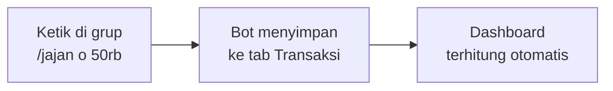
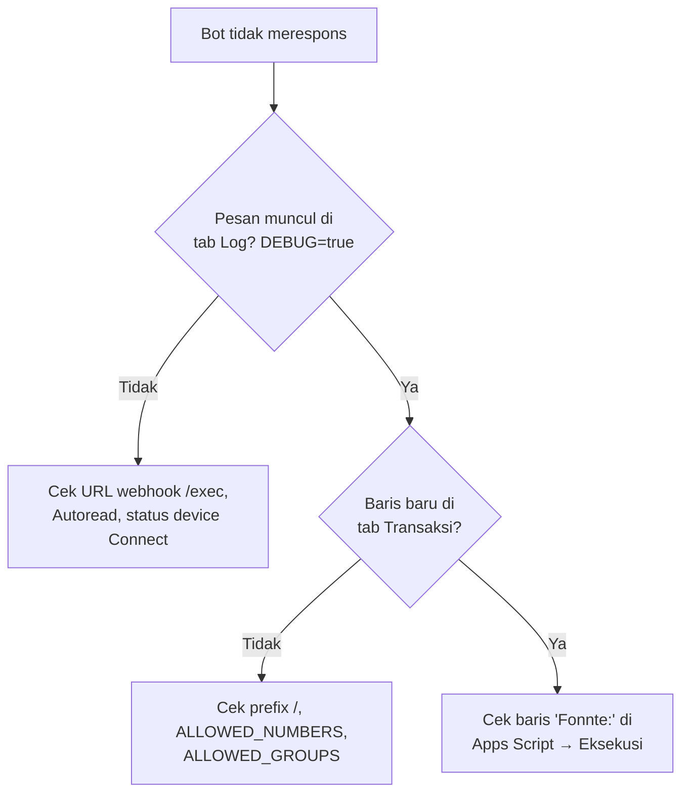

# Panduan Pengguna — Bot Keuangan WhatsApp

Bot ini mencatat pemasukan, tabungan, dan pengeluaran keluarga langsung dari WhatsApp ke Google Sheets, lalu menyajikannya sebagai dashboard **Target vs Realisasi** per periode gajian (tanggal 25 s/d 24).

> Dokumen teknis lengkap ada di [`SRS.md`](./SRS.md).

---

## Daftar Isi

**Bagian A — Untuk Anggota Grup**
1. [Cara Kerja Singkat](#1-cara-kerja-singkat)
2. [Cara Mencatat](#2-cara-mencatat)
3. [Perintah](#3-perintah)
4. [Kapan Bot Membalas](#4-kapan-bot-membalas)
5. [Membaca Dashboard](#5-membaca-dashboard)
6. [Tips & FAQ Anggota](#6-tips--faq-anggota)

**Bagian B — Untuk Admin**

7. [Persiapan](#7-persiapan)
8. [Instalasi dari Nol](#8-instalasi-dari-nol)
9. [Konfigurasi](#9-konfigurasi)
10. [Mengelola Anggaran dan Pos](#10-mengelola-anggaran-dan-pos)
11. [Perawatan Rutin](#11-perawatan-rutin)
12. [Pemecahan Masalah](#12-pemecahan-masalah)
13. [Keamanan dan Repositori](#13-keamanan-dan-repositori)

---

# Bagian A — Untuk Anggota Grup

## 1. Cara Kerja Singkat



- Semua anggota mencatat ke **satu buku bersama** milik grup.
- Pesan untuk bot **wajib diawali `/`**. Obrolan biasa tanpa `/` diabaikan.
- Satu **periode gajian** = tanggal **25** sampai tanggal **24** bulan berikutnya. Contoh: *Gajian Sep 2026* = 25 Sep – 24 Okt 2026.

## 2. Cara Mencatat

### 2.1 Pola Penulisan

```
/jenis  nominal  keterangan  #pos
```

| Bagian | Wajib? | Isi |
|---|---|---|
| `/` | ✅ (di grup) | Awalan pesan untuk bot |
| `jenis` | ❌ | `keluar`, `masuk`, atau `nabung`. Jika dikosongkan, ditebak dari keterangan. |
| `nominal` | ✅ | `25000`, `25.000`, `25rb`, `25k`, `1,5jt`, `2juta` |
| `keterangan` | Disarankan | Sebutkan **nama pos**, misalnya `jajan o`, `kontrakan` |
| `#pos` | ❌ | Dipakai bila pos tidak terbaca otomatis |

### 2.2 Contoh

**Pengeluaran** — cukup sebut nama posnya:

```
/kontrakan 1.500.000
/listrik 250rb
/krl 6000
/tj 3500
/jajan o 50rb
/belanja sayur 85rb
/beras 75rb
/bensin 50rb
/kopi 20rb
```

**Pemasukan** — awali dengan `masuk`:

```
/masuk 5.000.000 gaji istri
/masuk 4.000.000 gaji suami
/masuk 500rb bonus
```

**Tabungan** — awali dengan `nabung`:

```
/nabung 1jt kuliah a
/nabung 1jt dana darurat
/nabung 1.000.000 rumah
```

**Pos tidak terbaca** — tambahkan tagar:

```
/keluar 300rb kado nikahan #Lainnya
/keluar 45rb obat #Kesehatan
```

> Pengeluaran yang tidak cocok dengan pos mana pun tetap tersimpan dan muncul di baris **Di luar pos** pada dashboard.

### 2.3 Kata yang Perlu Ditulis Lengkap

| Tulis | Jangan hanya |
|---|---|
| `renang suami` / `renang istri` | `renang` |
| `gaji istri` / `gaji suami` | `gaji` (akan masuk *Pemasukan Lain*) |
| `jajan istri` / `jajan o` | `jajan` (akan masuk *Jajan Self-Care*) |
| `belanja bulanan` | `belanja` (akan masuk *Belanja Mingguan*) |

Daftar lengkap pos dan kata kuncinya bisa dilihat dengan perintah `/kategori`.

## 3. Perintah

| Perintah | Fungsi |
|---|---|
| `/bantuan` | Menampilkan pola penulisan dan daftar perintah |
| `/sisa` | Sisa anggaran setiap pos di periode berjalan |
| `/hari ini` | Semua catatan hari ini beserta nama pencatat |
| `/rekap` | Rekap periode gajian berjalan per pos dan per anggota |
| `/rekap 9 2026` | Rekap periode gajian tertentu (contoh: Gajian Sep 2026) |
| `/saldo` | Total masuk, nabung, keluar, dan sisa kas sepanjang waktu |
| `/hapus` | Menghapus catatan **terakhir milik Anda sendiri** |
| `/kategori` | Daftar pos dan kata kuncinya |

## 4. Kapan Bot Membalas

| Pesan di grup | Dibalas? |
|---|---|
| Catatan transaksi (`/kopi 20rb`) | ❌ Tidak — tersimpan diam-diam untuk menghemat kuota |
| Format salah (mis. lupa nominal) | ✅ Ya — supaya Anda tahu catatan **tidak** tersimpan |
| Perintah (`/sisa`, `/rekap`, dll.) | ✅ Ya |
| Pesan tanpa `/` | ❌ Diabaikan |

Karena tidak ada konfirmasi, cek sesekali dengan `/hari ini` untuk memastikan semua catatan masuk.

## 5. Membaca Dashboard

Spreadsheet dapat dibuka dengan akses **Pelihat**. Tab yang relevan:

### 5.1 Realisasi Periode

- Pilih periode di sel **B2** (bawaan: *Periode berjalan*).
- Setiap pos menampilkan **Target**, **Realisasi**, **Sisa / Kurang**, **% Target**, dan **Status**.

| Status | Arti |
|---|---|
| 🟢 Aman | Terpakai < 80% |
| 🟡 Hampir habis | Terpakai ≥ 80% |
| 🔴 Lewat anggaran | Terpakai > 100% |
| ⚠️ Tidak dianggarkan | Ada pengeluaran di pos bertarget 0 |
| ✅ Tercapai / ⏳ Sebagian / ⬜ Belum | Untuk pemasukan dan tabungan |

Di bagian bawah ada **Scorecard Arus Kas**: total pemasukan, tabungan, pengeluaran, dan **Sisa Kas**.

### 5.2 Realisasi 12 Bulan

- Satu kolom per periode gajian, dari *Gajian Sep 2026* sampai *Gajian Agu 2027*.
- 🟥 Merah = pengeluaran lewat target, 🟩 hijau = target tabungan tercapai, 🟨 kuning = periode berjalan.
- Baris **Akumulasi Tabungan** menunjukkan total tabungan yang terkumpul dari bulan ke bulan.

## 6. Tips & FAQ Anggota

**Saya salah ketik nominal, bagaimana?**
Kirim `/hapus` untuk menghapus catatan terakhir Anda, lalu kirim ulang yang benar.

**Saya mau menghapus catatan anggota lain.**
Tidak bisa lewat bot. Minta admin menghapusnya langsung di tab `Transaksi`.

**Saya mencatat lewat chat pribadi ke bot, kok tidak muncul di dashboard?**
Dashboard hanya menghitung catatan dari grup. Catat transaksi rumah tangga di grup.

**Bot tidak membalas `/sisa`.**
Pastikan diawali `/` dan tidak ada spasi sebelum `/`. Jika tetap tidak dibalas, hubungi admin (kemungkinan kuota Fonnte habis atau perangkat bot terputus).

---

# Bagian B — Untuk Admin

## 7. Persiapan

| Kebutuhan | Keterangan |
|---|---|
| Akun Google | Pemilik spreadsheet dan proyek Apps Script |
| Akun Fonnte | <https://fonnte.com>, satu device |
| Nomor WhatsApp bot | **Berbeda** dari nomor pribadi; disarankan WhatsApp Business |
| File Google Sheets | Bukan `.xlsx`. Jika masih Excel: **File → Simpan sebagai Google Spreadsheet** |

## 8. Instalasi dari Nol

### Langkah 1 — Tautkan nomor bot ke Fonnte
1. Daftarkan nomor bot di WhatsApp/WhatsApp Business.
2. Di dashboard Fonnte → **Device → Connect**, pindai QR dari WhatsApp bot (**Perangkat Tertaut → Tautkan Perangkat**).
3. Pastikan status device **Connect**, lalu salin **token device** (bukan token akun).

### Langkah 2 — Pasang script
1. Buka spreadsheet → **Ekstensi → Apps Script**.
2. Hapus semua kode bawaan; pastikan **hanya ada satu file `.gs`**.
3. Tempel isi `BotKeuanganWA.gs`.
4. Isi `CONFIG` (lihat [§9](#9-konfigurasi)), lalu **Ctrl+S**.

### Langkah 3 — Samakan zona waktu
- Apps Script: **Setelan proyek ⚙️ → Zona waktu → (GMT+07:00) Jakarta**
- Spreadsheet: **File → Setelan → Zona waktu → Jakarta**

### Langkah 4 — Inisialisasi
1. Jalankan `setup` → izinkan akses (**Advanced → Go to … (unsafe) → Allow**).
2. (Opsional) Jalankan `testPengenalan` untuk melihat hasil pengenalan pos di log.
3. Jalankan `buatDashboard`. Tab `Target Anggaran`, `Realisasi Periode`, dan `Realisasi 12 Bulan` akan dibuat.

### Langkah 5 — Deploy sebagai Web App
1. **Terapkan → Deployment baru → ⚙️ → Aplikasi web**.
2. *Jalankan sebagai*: **Saya**; *Siapa yang memiliki akses*: **Siapa saja**.
3. Salin URL yang berakhiran `/exec`. Buka di browser; harus muncul *Bot keuangan WhatsApp aktif ✅*.

### Langkah 6 — Pasang webhook
1. Fonnte → **Device → Edit**.
2. Tempel URL `/exec` di kolom **Webhook**, aktifkan **Autoread**, simpan.

### Langkah 7 — Masukkan bot ke grup
1. Tambahkan nomor bot sebagai anggota grup.
2. Jalankan `ambilDaftarGrup` agar Fonnte mengenali grup tersebut.
3. Kirim `/bantuan` di grup untuk menguji.

### Langkah 8 — Uji akhir
| Uji | Hasil yang diharapkan |
|---|---|
| Kirim `/jajan o 1000` di grup | Tidak ada balasan; baris baru muncul di tab `Transaksi` dengan kategori *Jajan O* |
| Kirim `/sisa` | Bot membalas daftar sisa anggaran |
| Cek tab `Realisasi Periode` | Jajan O berisi Rp 1.000 |
| Kirim `/hapus` | Bot membalas konfirmasi penghapusan |

## 9. Konfigurasi

Semua pengaturan ada di objek `CONFIG` di bagian atas script.

```javascript
const CONFIG = {
  FONNTE_TOKEN: 'ISI_TOKEN_FONNTE_ANDA',
  ALLOWED_NUMBERS: ['628xxxxxxxxx1', '628xxxxxxxxx2'],
  IZINKAN_GRUP: true,
  ALLOWED_GROUPS: ['120363xxxxxxxxxxxx@g.us'],
  PREFIX_GRUP: '/',
  BALAS_TRANSAKSI_GRUP: false,
  BALAS_FORMAT_SALAH_GRUP: true,
  DEBUG: false,
  GRUP_DASHBOARD: '120363xxxxxxxxxxxx@g.us',
  TANGGAL_GAJIAN: 25,
  PERIODE_AWAL: { tahun: 2026, bulan: 9 },
  JUMLAH_PERIODE: 12,
  // ...nama-nama tab
};
```

**Aturan penulisan nomor:** awali `62` (bukan `0`), tanpa spasi/strip/`+`, diapit tanda kutip, dipisah koma.

**Cara menemukan ID grup:** set `DEBUG: true`, deploy versi baru, kirim pesan ke grup, lalu lihat kolom B tab `Log` → nilai `sender` yang berakhiran `@g.us`. Kembalikan `DEBUG: false` setelahnya.

> ⚠️ **Setiap kali `CONFIG` atau kode diubah**: Ctrl+S → **Terapkan → Kelola deployment → ✏️ → Versi: Versi baru → Terapkan**. Tanpa ini, bot tetap memakai kode lama. URL webhook tidak berubah.

## 10. Mengelola Anggaran dan Pos

### 10.1 Mengubah target
Edit angka di **kolom C (kuning)** tab `Target Anggaran`. Dashboard dan balasan `/sisa` ikut berubah (balasan bot dapat tertunda hingga 5 menit karena cache). Angka ini **tidak ditimpa** saat `buatDashboard` dijalankan ulang.

### 10.2 Menambah pos baru
1. Tambahkan objek baru di daftar `POS`, misalnya:
   ```javascript
   { k: 'Pengeluaran', nama: 'Asuransi', target: 300000, cari: '', kata: ['asuransi', 'premi'] },
   ```
2. Jalankan `testPengenalan` untuk memastikan kata kuncinya terbaca.
3. Jalankan `buatDashboard` — pos baru ditambahkan ke `Target Anggaran` dan dashboard.
4. Deploy versi baru.

### 10.3 Menambah kata kunci
Tambahkan kata (huruf kecil) ke array `kata` pada pos terkait, lalu deploy versi baru. Bila beberapa kata cocok, **kata terpanjang** yang menang.

### 10.4 Memperpanjang dashboard
Setelah periode ke-12 (*Gajian Agu 2027*), ubah `PERIODE_AWAL` (misalnya `{ tahun: 2027, bulan: 9 }`) lalu jalankan `buatDashboard`. Data transaksi lama tetap aman.

## 11. Perawatan Rutin

| Frekuensi | Tindakan |
|---|---|
| Mingguan | Buka WhatsApp di HP nomor bot agar tautan Fonnte tidak terputus |
| Saat ada anggota baru | Tambahkan nomornya ke `ALLOWED_NUMBERS` → deploy versi baru |
| Saat bot masuk grup baru | Jalankan `ambilDaftarGrup` |
| Awal periode gajian | Kirim `/rekap` periode sebelumnya untuk evaluasi bersama |
| Tahunan | Perpanjang dashboard ([§10.4](#104-memperpanjang-dashboard)); arsipkan transaksi lama bila > 10.000 baris |

## 12. Pemecahan Masalah

### 12.1 Alur diagnosis



### 12.2 Tabel masalah umum

| Gejala / Pesan | Penyebab | Solusi |
|---|---|---|
| `SyntaxError: Identifier 'CONFIG' has already been declared` | Ada lebih dari satu file `.gs` | Hapus file lain, sisakan satu |
| Bot tidak membalas sama sekali, Log kosong | Webhook salah / device terputus | Periksa URL `/exec`, Autoread, scan ulang QR |
| Log terisi, Transaksi tidak bertambah | Pesan tersaring | Pastikan diawali `/`; cocokkan nomor di `ALLOWED_NUMBERS` dengan nilai `member` di Log |
| Transaksi tersimpan, balasan tidak datang | Pengiriman Fonnte gagal | Lihat baris `Fonnte:` di menu **Eksekusi** |
| `Fonnte: {"reason":"invalid token"}` | Token akun, bukan token device | Salin token dari **Device** |
| `Fonnte: {"reason":"invalid group id"}` | Grup belum dikenal Fonnte | Jalankan `ambilDaftarGrup` |
| Bot masih membalas transaksi di grup | Versi baru belum di-deploy | **Kelola deployment → Versi baru** |
| Dashboard penuh `#ERROR!` / `#NAME?` | Rumus tidak sesuai lokal spreadsheet | Pakai script ≥ v3.3, jalankan ulang `buatDashboard` (log harus menampilkan *Pemisah rumus*) |
| Error *tidak dapat membekukan kolom … sel gabungan* | Script versi lama | Pakai script ≥ v3.1, jalankan ulang `buatDashboard` |
| Semua target Rp 0 | Tab `Target Anggaran` belum ada | Jalankan `buatDashboard` |
| Transaksi tanggal 25 masuk periode sebelumnya | Zona waktu tidak sama | Set Jakarta di Apps Script **dan** spreadsheet |
| Bot berhenti setelah beberapa minggu | Tautan perangkat WhatsApp kedaluwarsa | Buka WhatsApp di HP bot; scan ulang QR bila perlu |

### 12.3 Fungsi bantu di editor

| Fungsi | Kegunaan |
|---|---|
| `setup` | Membuat/memperbaiki tab `Transaksi` |
| `buatDashboard` | Membuat ulang semua tab dashboard |
| `testPengenalan` | Menguji pengenalan pos tanpa menyimpan data |
| `ambilDaftarGrup` | Mendaftarkan grup baru ke Fonnte |

## 13. Keamanan dan Repositori

Sebelum `push` ke GitHub:

- [ ] `FONNTE_TOKEN` berisi placeholder `'ISI_TOKEN_FONNTE_ANDA'`
- [ ] `ALLOWED_NUMBERS`, `ALLOWED_GROUPS`, dan `GRUP_DASHBOARD` berisi contoh (`628xxxxxxxxxx`, `120363xxxxxxxxxxxx@g.us`)
- [ ] Tidak ada screenshot yang memperlihatkan token, nomor telepon, atau ID grup asli
- [ ] Jika token pernah terlanjur ter-commit atau terlihat, **buat token baru** di dashboard Fonnte

Disarankan menjadikan repositori **privat** dan membagikan spreadsheet ke anggota keluarga hanya dengan akses **Pelihat**.
